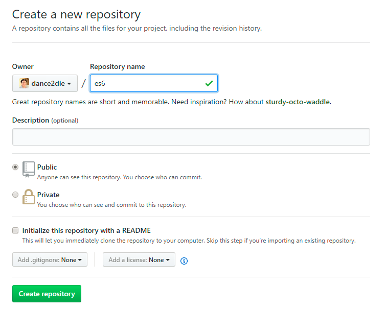
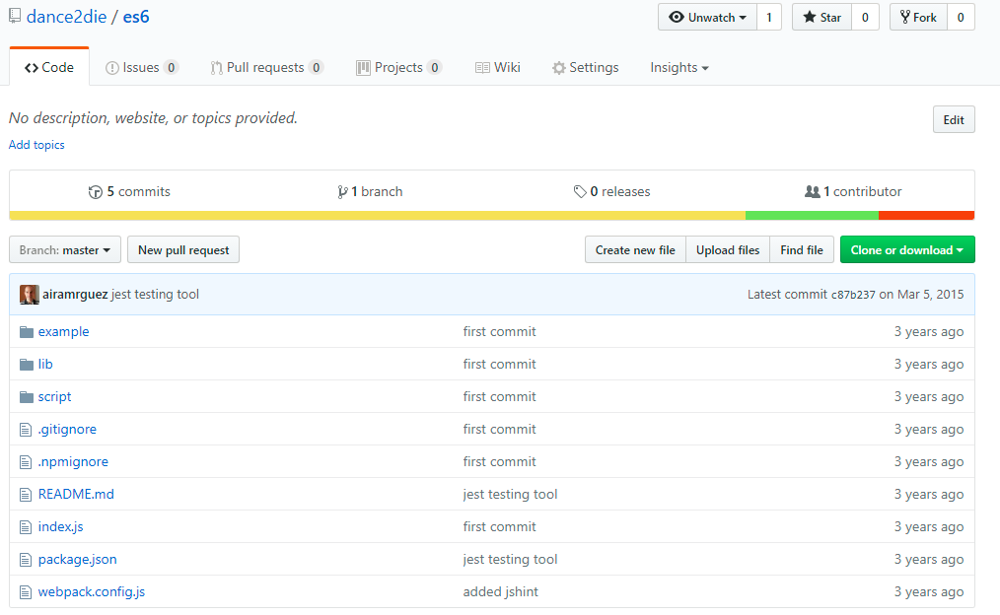

 **UPDATE**: April 21, 2019 

Both [Eugene Karataev](https://dev.to/karataev) & [Noah Pederson](https://dev.to/chiefnoah) provided a better way than what's in this post.

Check'em out on the [dev.to post](https://dev.to/dance2die/push-git-cloned-repository-to-your-own-on-github-1ili) thread.

- [Eugene Karataev](http://postepenno.com/):  [https://dev.to/karataev/comment/a906](https://dev.to/karataev/comment/a906)
- [Noah Pederson](https://packetlostandfound.us/): [https://dev.to/chiefnoah/comment/a904](https://dev.to/chiefnoah/comment/a904)

* * *

You git cloned a repository from GitHub without forking it.

The problem is that you made a bunch of changes and want to publish it to a new GitHub repository.

What are the steps required to accomplish it?

### TL;DR

> Remove original remote and add your own

### Scenario

Suppose that you are taking an advantage of all javascript boilerplates floating around on GitHub since setting up Webpack and environment required manually for simple code is a bit too much.

### Problem

But when you try to commit the code back to GitHub, you get an error message that you don't have a permission since the cloned repo belongs to another user.

`gist:dance2die/841f50055b95318e29f31376e0bd18fa`

### How to commit to your own GitHub repository

First, remove the remote repository associated using `git remote rm origin`.

`gist:dance2die/04273b00df9a7345bf4e3ee461816ac5`

Then [create your own repository](https://help.github.com/articles/create-a-repo/) on GitHub.

\[caption id="attachment\_2722" align="aligncenter" width="755"\] create a new repository\[/caption\]

After creating the repository, copy the repo URL.

\[caption id="attachment\_2723" align="alignleft" width="1002"\] copy the repo\[/caption\]

Now, add the URL to your repo.

`gist:dance2die/234f77836173c2271b4c63e3b45a2b2a`

Now you can push/publish it to your own repository!

`gist:dance2die/41dcb516ef61ba06ba75668923e54248`

Wolla! It's committed to your GitHub repository.

\[caption id="attachment\_2724" align="alignleft" width="1014"\] repo updated~\[/caption\]

### Alternative

You can simply download a zip version of the repository, `git init`, then add the remote yourself if you are uncomfortable with `git clone`.

### Resources

- [Cloning a Repo](https://help.github.com/articles/cloning-a-repository/)
- [Creating a Repo](https://help.github.com/articles/create-a-repo/)
- [Git Remote Documentation](https://git-scm.com/docs/git-remote)
- [Adding a Remote](https://help.github.com/articles/adding-a-remote/)
- [dance2die/es6](https://github.com/dance2die/es6)

### Help me improve this~

Git command is very flexible that there might be other ways to do it much easier. Please let me know if there is a way to do it without going through all these troubles :)
