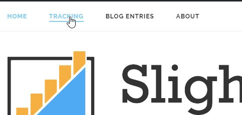

_Feature Image Credit - Image by [Sam Greenhalgh](https://www.flickr.com/photos/zapthedingbat/)_

[SmartCuts](https://www.amazon.com/Smartcuts-Breakthrough-Power-Lateral-Thinking/dp/0062560751/ref=sr_1_1?ie=UTF8&qid=1485056991&sr=8-1&keywords=smartcut) was the book that got me interested in reading back in 2015. I never read a single self-development book. Then I came to read [the Slight Edge](https://www.amazon.com/Slight-Edge-Turning-Disciplines-Happiness/dp/1626340463/ref=sr_1_1?ie=UTF8&qid=1485057083&sr=8-1&keywords=the+slight+edge) not long after and decided to make a reading a habit to replace my existing habit (reading manga) to **apply** what I learned from Charles Duhigg's [The Power of Habit](https://www.amazon.com/Power-Habit-What-Life-Business/dp/081298160X/ref=sr_1_1?ie=UTF8&qid=1485057128&sr=8-1&keywords=the+power+of+habit).

After a year of reading only 10 pages a day every day for a year, reading became sort of a new habit.

I read **90+ books** last year alone (Click "Tracking" menu, which takes you to Google Sheet. Then click on "Books I read in 2016" worksheet.)

I decided to post a blog to set my goal in stone by **making it public**.

Here are the **40 books** I will read this year.

Books are listed in no particular order. I usually read whatever I feel like reading at the moment.

**Fiction**

\[gallery columns="2" ids="175,174"\]

1. [Stories of Your LIfe](https://www.amazon.com/Stories-Your-Life-Others-Chiang/dp/1101972122/ref=sr_1_1?s=books&ie=UTF8&qid=1484875560&sr=1-1&keywords=Stories+of+Your+LIfe) by Ted Chang - The movie, [Arrival](http://www.imdb.com/title/tt2543164/?ref_=fn_al_tt_1), is based on one of the stories in this book. I haven't watched the movie but I'd like to read the book first.
2. [Seveneves](https://www.amazon.com/Seveneves-Neal-Stephenson/dp/0062334514/ref=sr_1_1?s=books&ie=UTF8&qid=1484875566&sr=1-1&keywords=SevenEves) by Neal Stephenson - Bill Gates wrote a [review](https://www.gatesnotes.com/Books/Seveneves) so I was interested.

**Programming**

There are only 4 books for programming because I started learning most of new materials from online contents (PluralSight, Udemy, blogs, magazines, or articles).

\[gallery columns="4" ids="201,202,203,204"\]

1. [Cracking the Coding Interview](https://www.amazon.com/Cracking-Coding-Interview-Programming-Questions/dp/0984782850/ref=sr_1_1?ie=UTF8&qid=1484876972&sr=8-1&keywords=cracking+the+coding+interview) (6th Edition) by Gayle Laakmann McDowell - To polish algorithms and data structure skills
2. [Extreme Programming Explained](https://www.amazon.com/Extreme-Programming-Explained-Embrace-Change/dp/0321278658/ref=sr_1_1?s=books&ie=UTF8&qid=1484875523&sr=1-1&keywords=Extreme+Programming+Explained) by Kent Beck and Cynthia Andres
3. [Kanban in Action](https://www.amazon.com/Kanban-Action-Marcus-Hammarberg/dp/1617291056/ref=sr_1_5?s=books&ie=UTF8&qid=1484958716&sr=1-5&keywords=kanban) by Marcus Hammarberg and Joakim Sunden - Interested after using Trello.
4. [Head First Design Patterns](https://www.amazon.com/Head-First-Design-Patterns-Brain-Friendly/dp/0596007124/ref=sr_1_1?s=books&ie=UTF8&qid=1484875532&sr=1-1&keywords=Head+First+Design+Patterns) by Eric Freeman, Bert Bates, Kathy Sierra, Elisabeth Robson - read the beginning a few times but couldn't finish it. This time, I am reading to the end.

**Non-Fiction**

\[gallery columns="4" ids="181,182,183,184,185,186,188,189,190,191,193,194,195,196,197,198,199,200"\]

1. [The Slight Edge](https://www.amazon.com/Slight-Edge-Turning-Disciplines-Happiness/dp/1626340463/ref=sr_1_1?ie=UTF8&qid=1484875244&sr=8-1&keywords=the+slight+edge) by Jeff Olson - This is the book where I got the blog name from. Reading for the second time.
2. [The Energy Bus](https://www.amazon.com/Energy-Bus-Rules-Fuel-Positive/dp/0470100281/ref=sr_1_1?s=books&ie=UTF8&qid=1484875270&sr=1-1&keywords=the+energy+bus) by Jon Gordon.
3. [The Obstacle is the Way](https://www.amazon.com/Obstacle-Way-Timeless-Turning-Triumph/dp/1591846358/ref=sr_1_1?s=books&ie=UTF8&qid=1484875298&sr=1-1&keywords=the+obstacle+is+the+way) by Ryan Holiday - I don't know who I heard about this book from...
4. [Sorted](https://www.amazon.com/Sorted-Freedom-Structure-Gillian-Perkins/dp/1532976445/ref=sr_1_1?s=books&ie=UTF8&qid=1484875306&sr=1-1&keywords=sorted) by Gillian Perkins - Another book on productivity
5. [Disrupt Yourself](https://www.amazon.com/Disrupt-Yourself-Putting-Disruptive-Innovation/dp/1629560529/ref=sr_1_1?s=books&ie=UTF8&qid=1484875323&sr=1-1&keywords=disrupt+yourself) by Whitney L. Johnson - Planning for the future
6. [The Innovator's Dilemma](https://www.amazon.com/Innovator-s-Dilemma-Technologies-Management-Innovation/dp/1633691780/ref=sr_1_1?s=books&ie=UTF8&qid=1484875334&sr=1-1&keywords=the+innovator%27s+dilemma) by Clayton M. Christensen - To learn what I can do to improve the company I work for.
7. [Energy - Myths and Realities](https://www.amazon.com/Energy-Myths-Realities-Bringing-Science/dp/0844743283/ref=sr_1_1?s=books&ie=UTF8&qid=1484875346&sr=1-1&keywords=energy+myths+and+realities) by Vaclav Smil - Something I've never read about.
8. [The Vital Question](https://www.amazon.com/Vital-Question-Evolution-Origins-Complex/dp/0393352978/ref=sr_1_1?s=books&ie=UTF8&qid=1484875356&sr=1-1&keywords=the+vital+question) by Nick Lane - Evolution theory explained in simple terms.
9. [The Ten Day MBA](https://www.amazon.com/Ten-Day-MBA-4th-Step-Step/dp/0062199579/ref=sr_1_1?s=books&ie=UTF8&qid=1484875369&sr=1-1&keywords=the+ten+day+mba) by Steven A. Silbiger - To reach a bigger goal in life.
10. [Rework](https://www.amazon.com/Rework-Jason-Fried/dp/0307463745/ref=sr_1_1?s=books&ie=UTF8&qid=1484875377&sr=1-1&keywords=rework) and [Remote](https://www.amazon.com/Remote-Office-Required-Jason-Fried/dp/0804137501/ref=asap_bc?ie=UTF8) by DHH (David Heinemeier Hansson, the creator of Ruby on Rails) - To improve working condition.
11. [How Not To Be Wrong](https://www.amazon.com/How-Not-Be-Wrong-Mathematical/dp/0143127535/ref=sr_1_1?s=books&ie=UTF8&qid=1484875422&sr=1-1&keywords=how+not+to+be+wrong) by Jordan Ellenberg - My math skill is subpar as a developer
12. [How the World Sees You](https://www.amazon.com/How-World-Sees-You-Fascination/dp/0062230697/ref=sr_1_1?s=books&ie=UTF8&qid=1484875431&sr=1-1&keywords=How+the+World+Sees+You) by Sally Hogshead - To improve my self worth.
13. [Zero to One](https://www.amazon.com/Zero-One-Notes-Startups-Future/dp/0804139296/ref=sr_1_1?s=books&ie=UTF8&qid=1484875442&sr=1-1&keywords=zero+to+one) by Peter Thiel - I've seen many developers reading this book.
14. [Smarter Faster Better](https://www.amazon.com/Smarter-Faster-Better-Productive-Business/dp/081299339X/ref=sr_1_1?s=books&ie=UTF8&qid=1484875450&sr=1-1&keywords=Smarter+Faster+Better) by Charles Duhigg (the author of the Power of Habit) - I liked his previous work, The Power of Habit.
15. [Better and Faster](https://www.amazon.com/Better-Faster-Proven-Unstoppable-Ideas/dp/0385346549/ref=sr_1_1?s=books&ie=UTF8&qid=1484875472&sr=1-1&keywords=better+and+faster) by Jeremy Gutsche - I don't believe in taking a shortcut in life but still interesting to check it out.
16. [Thinking, Fast and Slow](https://www.amazon.com/Thinking-Fast-Slow-Daniel-Kahneman/dp/0374533555/ref=sr_1_1?s=books&ie=UTF8&qid=1484875481&sr=1-1&keywords=Thinking%2C+Fast+and+Slow) by Daniel Kahneman - Heard many good things about this book.
17. [Bold](https://www.amazon.com/Bold-Create-Wealth-Impact-World/dp/1476709580/ref=sr_1_1?s=books&ie=UTF8&qid=1484875502&sr=1-1&keywords=bold) by Peter H. Diamandis and Steven Kotler - Researched and found it after reading "10x Thinking" chapter in SmartCuts

**Korean Books** (Both fiction and non-fictions)

\[gallery columns="4" ids="219,220,221,222,223,224,225,226,227,228,229,230,231,232,233,234"\]

1. [플루언트](http://www.bandibookus.com/front/product/detailProduct.do?prodId=3996433) (Fluent) by 조승연 ([Seungyeon Cho](https://twitter.com/totalintelli?lang=ko)) - Liberal Arts book on English.
2. [손자병법](http://www.bandibookus.com/front/product/detailProduct.do?prodId=3991270) (The Art of War) by 손자 (Sun Tzu) - Korean Translation. Wanted to read after watching a short video on BusinessInsider, '[The Art Of War' holds the keys to success on Wall Street](http://www.businessinsider.com/art-of-war-wall-street-psychology-2015-10).
3. [열한 계단](http://www.bandibookus.com/front/product/detailProduct.do?prodId=4014511) (11 Steps (or Stairs?)) by 채사장 - Another book on Liberal Arts.
4. [My Romantic Comedy SNAFU](http://www.bandibookus.com/front/product/detailProduct.do?prodId=3528085) (Japanese Light Novel) volume 1~5 - A comedy about a loner Japanese high school student having trouble with romantic relationship. There is an [anime](https://myanimelist.net/anime/14813/Yahari_Ore_no_Seishun_Love_Comedy_wa_Machigatteiru) based on this novel.
5. [유녀전기](http://www.bandibookus.com/front/product/detailProduct.do?prodId=3824934) (Youjo Senki, Japanese Light Novel) volume 1~6 - A story about an elite salaryman reincarnated into a blonde girl fighting war in a world with magic. Found it after watching an [anime](https://myanimelist.net/anime/32615/Youjo_Senki) this season.
6. [이 세계가 게임이란 사실은 나만이 알고 있다](http://www.bandibookus.com/front/product/detailProduct.do?prodId=4012005) (literal translation - _Only_ I _Know_ That This *World Is a Game\_\_,* Japanese Light Novel) volume 6 - A comedy where a main character is stuck in a game and he is the only one who knows that others are just a part of an RPG game.
7. [전생했더니 슬라임이었던 건에 대하여](http://www.bandibookus.com/front/product/detailProduct.do?prodId=4020985) (Regarding Reincarnated to Slime, Japanese Light Novel) volume 8~8.5 - Another novel where a main character dies in real world and reincarnated in another world. Not as a human but as a slime!

### Conclusion

I WILL read all 40 books by the end of 2017. It's much less than the number of books I read last year. The reason is because I randomly pick up books (either in English or in Korean) on a whim whenever I think a certain knowledge is required or just want to have fun reading. And also, I read many Korean books online on a site called Munpia where authors write a chapter or two every day.
