**UPDATE**: October 13th, 2018

Following post uses Babel 7 & Webpack 4.

https://www.slightedgecoder.com/2018/10/13/setting-up-a-react-environment-for-asp-net-mvc/

---

I still haven't moved to ASP.NET Core and still use ASP.NET MVC. As I am learning ES6 features I've been looking for articles for setting up an environment for ES6 for ASP.NET MVC.

Unfortunately, all the articles I've run into dealt with ASP.NET Core and had to come up with my own way after combining all the resources I've been reading and watching.

This article with show you how to set up ASP.NET MVC 5 to enable ES6 javascript development using [Webpack](https://webpack.github.io/) and [Babel](https://babeljs.io/).

**UPDATE**: 6/13/2018 [Works for Webpack 4](https://www.slightedgecoder.com/2017/05/22/setting-es6-environment-asp-net-mvc-5/#comment-3943320423) - Thank you, [Brent Labasan](https://disqus.com/by/brentlabasan/)😁

**UPDATE**: 1/13/2018 Added `npm-watch` to make the refreshing easier (Thank you, [digiface](https://disqus.com/by/disqus_IDFdu7rgFV/) & [Frank Nguyen](https://disqus.com/by/disqus_udhcEu1mWd/) for the feedback 👍)

**UPDATE**: 1/7/2018 Babel preset used changed from [babel-preset-es2015](https://babeljs.io/docs/plugins/preset-es2015/) to [babel-preset-env](https://babeljs.io/env/) according to Babel's recommendation.

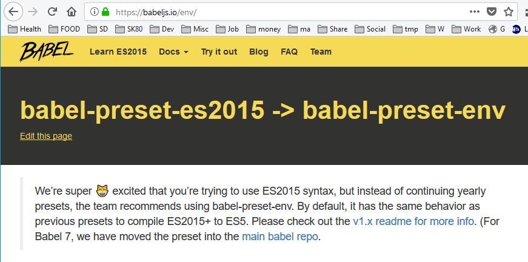

**UPDATE**: 9/22/2017

I created a 5-minute walkthrough [video](https://youtu.be/wbZnl93g_3I).

https://youtu.be/wbZnl93g_3I

## Step by Step Guide

1. [Set up ASP.NET MVC 5](#step1)
2. [Set up NPM configuration and packages](#step2)
3. [Install Webpack and Babel](#step3)
4. [Create some ES6 javascript files](#step4)
5. [Create an ASP.NET Controller and a View](#step5)
6. [Configure Webpack](#step6)
7. [Configure Babel](#step7)
8. [Run ASP.NET MVC](#step8)
9. [Monitoring file changes with](#step9) [npm-watch](https://www.npmjs.com/package/npm-watch)

##### 1. Set up ASP.NET MVC 5

Create a new solution in Visual Studio. I am using VS 2015 Professional.

Create a new ASP.NET MVC 5 project.

Right click on Solution and then "Add -> New Project".

Select an "Empty" template with "MVC" option.

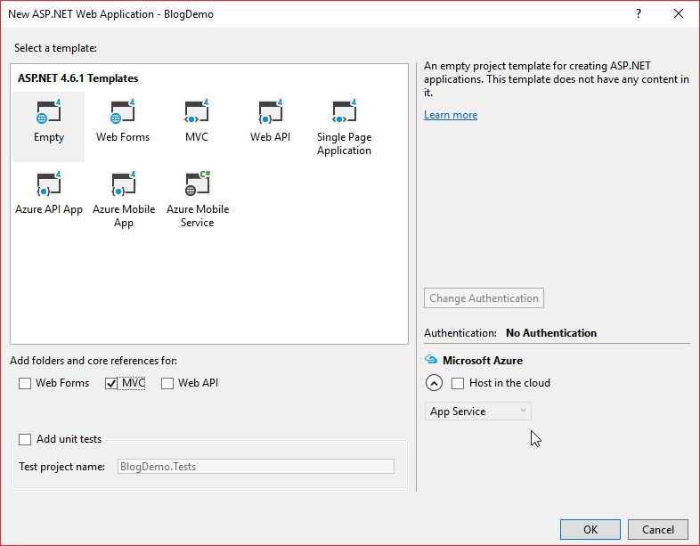

##### 2. Set up NPM configuration and packages

Open cmd and go to the root of the project.

Create a new "package.json" configuration file for NPM by running following command.

```bash
npm init -y
```

"-y" option creates a new file without prompting the user.

##### 3. Install Webpack and Babel

Run the following command in cmd.

```bash
npm install --save-dev webpack babel-core babel-loader babel-polyfill babel-preset-env
```

Above command will install necessary packages for Babel and Webpack.

Now let's include `package.json` in VS Solution Explorer. Go to "Solution Explorer", and click on "Show All Files" button.

"package.json" will show up in the explorer.

Right click on "package.json" and include it in the project.

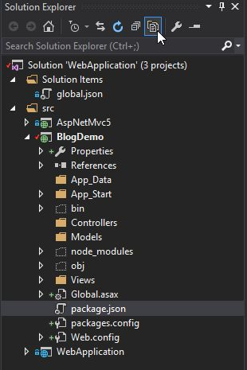

If you open up "package.json", you can see that "devDependencies" section has references to Babel and Webpack.

```json
"devDependencies": {
"babel-core": "^6.26.0",
"babel-loader": "^7.1.2",
"babel-polyfill": "^6.26.0",
"babel-preset-env": "^1.6.1",
"webpack": "^3.10.0"
}
```

##### 4. Create some ES6 javascript files

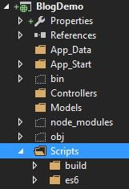Let's create some javascript files to transpile for a test.

Under project root, create a folder "Scripts" if one doesn't exist.

Create two more folders, "build" and "es6" under "Scripts".

Create two javascript files under "es6" folder.

1. person.js: contains "Person" class.
2. main.js: main entry point for the application.

**person.js**

```jsx
export default class Person {
  constructor(name, age) {
    this.name = name
    this.age = age
  }

  speak() {
    console.log(
      `Hi I'm ${this.name} and ${this.age} years old and I am awesome`
    )
  }
}
```

**main.js**

```javascript
import Person from "./person"

var person = new Person("David", 20)
person.speak()
```

##### 5. Create an ASP.NET Controller and a View

Right click on "Controllers" folder, and create an empty controller named, "HomeController".

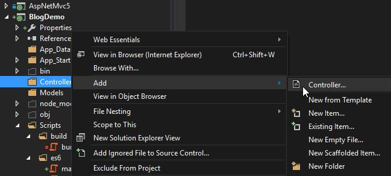

Right click on "View()" and click on "Add View".

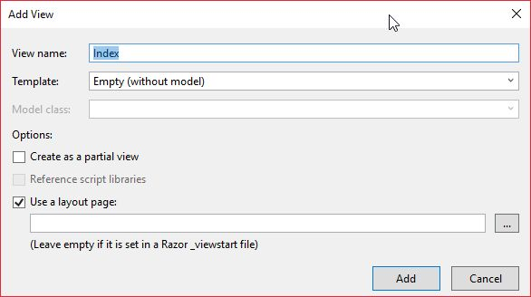

Add a script tag in `Views/Shared/_Layout.cshtml`.

```html
<script src="~/Scripts/build/bundle.js"></script>
```


##### 6. Configure Webpack

Create `webpack.config.js` on project root. Add following configuration option in the file.

`gist:dance2die/7898ed6dbfc121e6844a12beec114ea6`

- "entry" indicates files for webpack to work on.
- "output" specifies which folder ("path") to write to while "filename" specifies what the result file name should be.
- "module" instructs webpack to use Babel to transpile.
- "test" tells webpack to include all files with ".js" extension while "exclude" leaves out "node_module" folder.

** IMPORTANT **: If you are using Webpack 2 or above, replace `loaders`  with `rules` in `webpack.config.js`.

Refer to [this article](https://javascriptplayground.com/blog/2016/10/moving-to-webpack-2/#moduleloaders--modulerules) on migrating from Webpack 1 to Webpack 2.

Now let's update "package.json" to instruct NPM to call webpack.

Add a "scripts" section.

```json
"scripts": {
"build": "webpack"
},
```

We can configure Visual Studio to run `npm run build` during compile time.

Right-click on the project and select "properties" and go to "Build Events".

In the "Pre-build event command line:" enter following code snippet to run webpack when you compile the project.

```bash
npm run build --prefix $(ProjectDir)
```

##### 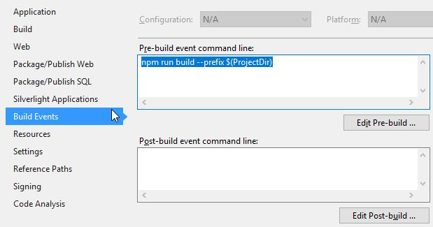

##### 7. Configure Babel

Open "package.json" and add Babel Preset.

```json
"babel": {
    "presets": [ "env" ]
},
```

Presets are basically a set of plugins so that you don't have to specify every plugin that are needed by Babel one by one. I will use ES2015 preset, which includes all Babel plugins listed here.

You can find a list of all Official Babel Presets in this [link](https://babeljs.io/docs/plugins/#presets-official-presets).

##### 8. Run ASP.NET MVC

Run the project by pressing "F5".

If you see "Hi I'm David and 20 years old and I am awesome", then it's set up properly.

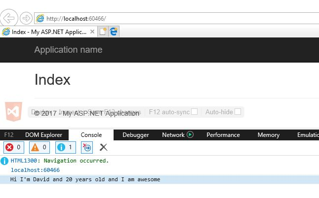

##### 9. Monitoring file changes with npm-watch

Everything up and running now but the problem is that when you make a file change and refresh the browser, the change would not take an effect.

There are many ways to monitor files changes but I will show you how to install and configure [npm-watch](https://www.npmjs.com/package/npm-watch) to do so. Let's install the `npm-watch` via NPM command.

```bash
npm install --save-dev npm-watch
```

We need to add a configuration for the command installed in `package.json`.

```json
"watch": {
    "build": "Scripts/es6/.js"
},
"scripts": {
    "watch": "npm-watch",
    "build": "webpack"
},
```

Now run `npm run watch` in the command line window after changing to the project directory where `package.json` is located (You can also run the command while the Visual Studio is in the debug/run mode).

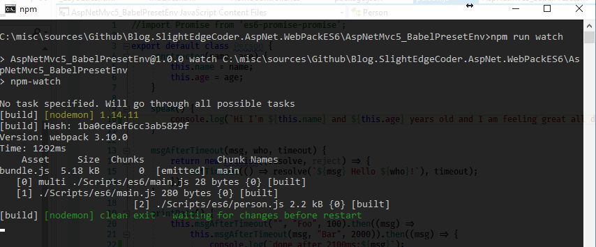

The command will watch for the javascript file changes. Let's update the `speak()` method in  `person.js` file while the Visual Studio is in debug mode.

```javascript
export default class Person {
//... constructor...
    speak() {
    console.log(`Hi I'm ${this.name} and ${this.age} years old and I love CodingBlocks podcast!`);
    }
...
```

Refresh the browser and you will see that the content has changed without restarting Visual Studio.

 You can see that `npm-watch` monitored the javascript file change and ran the build/webpack command automatically.

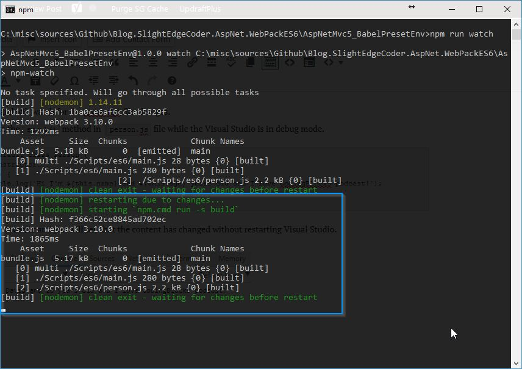

If you are using `npm-watch`, you can clear the "Pre-build event command line" command added in [step 6](#step6) (because `npm-watch` runs the `build` script, which calls `webpack` in turn).

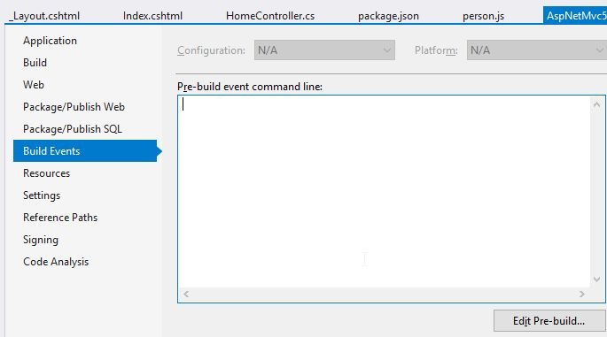

## Conclusion

I described how to set up ASP.NET MVC 5 web application for ES6 using Webpack and Babel. The "ceremony" seems too much of trouble. If you are ready to move on to ASP.NET Core, it'd be easier to do so (even though most of the steps would be the same) and you can find much more resources on how to do so.

The full source for this demo is avaialble on [GitHub](https://github.com/dance2die/Blog.SlightEdgeCoder.AspNet.WebPackES6/tree/master/BlogDemo). The new source using `babel-preset-env` is on the same repository but in different folder [AspNetMvc5_BabelPresetEnv.](https://github.com/dance2die/Blog.SlightEdgeCoder.AspNet.WebPackES6/tree/master/AspNetMvc5_BabelPresetEnv)
