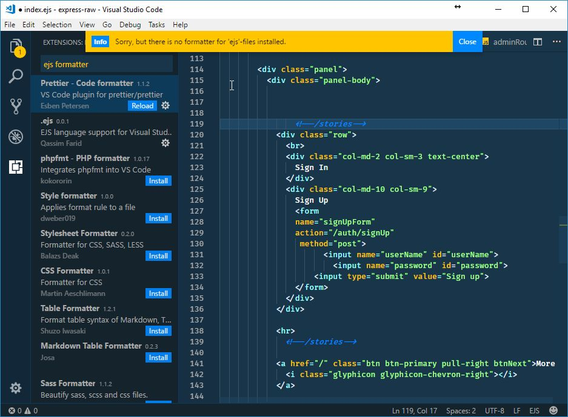
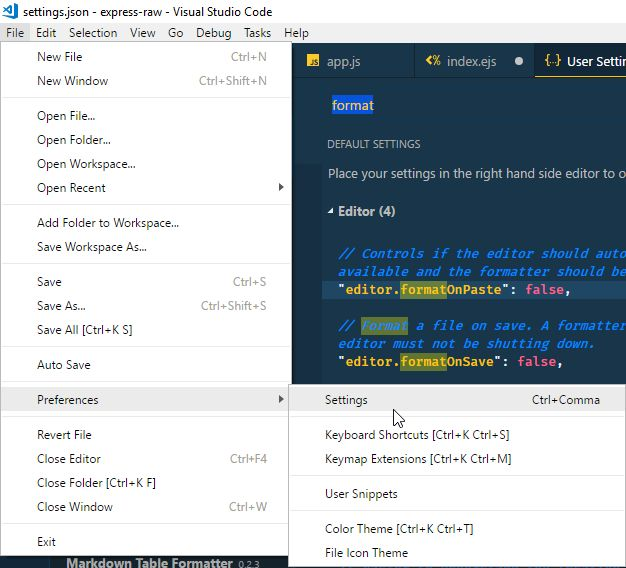
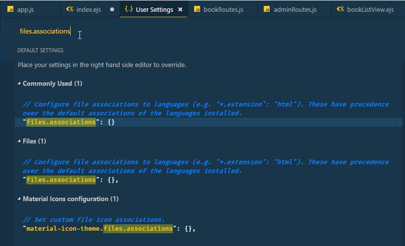
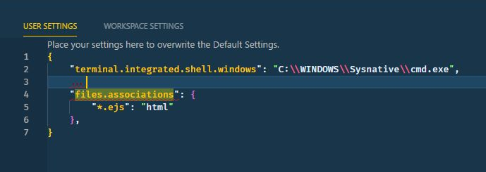
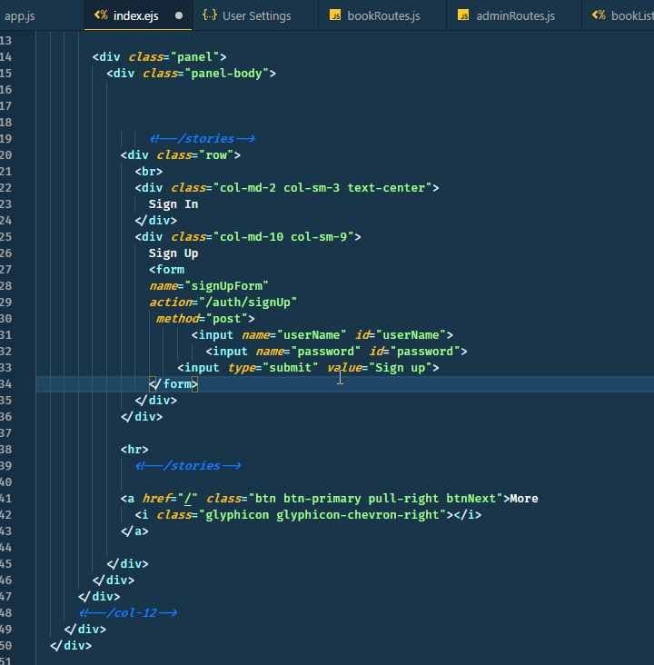

Featured Image - Photo by [Sai Kiran Anagani](https://unsplash.com/photos/5Ntkpxqt54Y?utm_source=unsplash&utm_medium=referral&utm_content=creditCopyText) on [Unsplash](https://unsplash.com/search/photos/visual-studio-code?utm_source=unsplash&utm_medium=referral&utm_content=creditCopyText) When you use [ExpressJS](https://expressjs.com/) using [EJS](http://ejs.co/) as a view engine in Visual Studio Code (VS Code hereafter), you might run into the following error message when trying to format an EJS page with [a keyboard shortcut](https://stackoverflow.com/a/29973358/4035) (Windows: Shift + Alt + F, MacOS: Shift + Option + F, Ubuntu Ctrl + Shift + I).

> Sorry, but there is no formatter for 'ejs'-files installed.

Luckily all you need to do is to add a user setting by associating `.ejs` extension to be handled with an HTML formatter.

Here are **3** steps to enable EJS files to be formatted with an HTML formatter.

#### Step 1 - Open User Settings

Go to "File -> Preferences -> Settings".

#### Step 2 - Search for "files.associations" setting

After searching for "files.assocations", copy `"files.assocations": {}` to clipboard for the next step.

#### Step 3 - Add a custom file association

On the right side under "user settings" tab, add

`gist:dance2die/f166bfa67e41fb91a8e051a013ac5550`

---

Now you can reformat with a keyboard shortcut without an error. The reformatted code looks like following. 

### Resource

[Visual Studio Code documentation](https://code.visualstudio.com/docs/languages/overview#_adding-a-file-extension-to-a-language) on `file.associations`.

