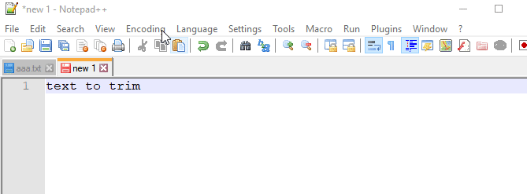

_Photo by _[_Stéphan Valentin_](https://unsplash.com/photos/-iXjUZlCsd0?utm_source=unsplash&utm_medium=referral&utm_content=creditCopyText)_ on _[_Unsplash_](https://unsplash.com/search/photos/power-shell?utm_source=unsplash&utm_medium=referral&utm_content=creditCopyText)

_**Another self note...**_

My coworker was cleaning up data in database as many data were entered with white space in it.

He did a quick `ltrim(rtrim(column))` to quickly get rid of spaces but didn't work.

As he had requested for help, I asked him to open Notepad++ and show all symbols.

But it wasn't showing the white text at the end of the text.

So I asked him to him to copy the white space then fire up PowerShell as I needed to see if the white space is indeed `32` in ASCII value.

``gist:dance2die/e3b94fe298bcd67c8acdd482b826a3b0``

<a href="https://gist.github.com/dance2die/e3b94fe298bcd67c8acdd482b826a3b0">View this gist on GitHub</a>

It turns out it was 160 meaning not a regular space thus can't be trimmed using `ltrim` or `rtrim`, which only trims white space of value 32.

So the fix was to  `replace(column, char(160), '')`, which took care of the issue.
