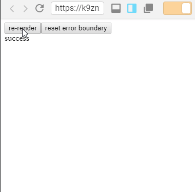

For [bunpkg](https://bunpkg.com), I use a Wizard component to display a series of steps to generate [UNPKG](https://unpkg.com) links.

When a request to Web API fails, an error is caught with an [Error Boundary](https://reactjs.org/docs/error-boundaries.html) component and display an error message in `ErrorBoundary.FallbackComponent` (from [react-error-boundary](https://github.com/bvaughn/react-error-boundary)  
, a simple but better implementation found on [React documentation](https://reactjs.org/docs/error-boundaries.html)).

But the error boundary wasn't reset when a user moved onto a different step in the wizard.

I would like to share my failed attempt and the proper workaround to reset Error Boundary components.

_But this can apply to your custom ErrorBoundary component._

## 😪 TL;DR

Update Error Boundary key props to let React reset the error state.

## ℹ About Demo

The following demo has a component that randomly throws an error and the error boundary shows the error message caught.

**_Credit:_** _the demo program is created by [Brian Vaugn](https://twitter.com/brian_d_vaughn/) on [CodeSandBox](https://codesandbox.io/s/k9znx9kj9r)._

Error Boundary Reset Demo

## 🙅‍♂️ First attempt (bad workaround)

`react-error-boundary` provides only [following props](https://github.com/bvaughn/react-error-boundary/blob/master/src/ErrorBoundary.js#L8) (leaving out `children`) and no way to clear the error caught.

- `FallbackComponent` -  A component to display in case of error
- `onError` - A callback triggered on error

[Following](https://github.com/bvaughn/react-error-boundary/blob/master/src/ErrorBoundary.js#L46) is how `ErrorBoundary.render` is implemented.

``gist:dance2die/b2af474fc9b7398b0f5f33f8ae35dfb2``

<a href="https://gist.github.com/dance2die/b2af474fc9b7398b0f5f33f8ae35dfb2">View this gist on GitHub</a>

`FallbackComponent` is displayed if an error exists.

So my first attempt was to create a reference (`this.errorBoundary`) and directly manipulate it as it is a 3rd party component.

_Yes, stupid of me to even attempt to directly manipulate the state even without using `setState`..._

``gist:dance2die/602254e2f6389e2a9f06f6c7d4185334``

<a href="https://gist.github.com/dance2die/602254e2f6389e2a9f06f6c7d4185334">View this gist on GitHub</a>

## 🙆 Proper Workaround

I knew that the workaround was just so hacky that I created a [request ticket](https://github.com/bvaughn/react-error-boundary/issues/23) on [react-error-boundary GitHub repository](https://github.com/bvaughn/react-error-boundary),  requesting to provide a way/prop to clear the error.

And Brian has replied with a [proper React-way of resetting error boundary](https://github.com/bvaughn/react-error-boundary/issues/23#issuecomment-425470511) - provide a key to an instance of ErrorBoundary component to reset the `instant.error` in the next render phase.

<a href="undefined">View this gist on GitHub</a>

``gist:dance2die/ebff548c1c4253f5c14349b3d6004a72``

<a href="https://gist.github.com/dance2die/ebff548c1c4253f5c14349b3d6004a72">View this gist on GitHub</a>

You can see that as you click on `reset error boundary` button, it updates the key on ErrorBoundary component (  
`<ErrorBoundary key={this.state.errorBoundaryKey}>`) using `handleResetButtonClick` method, which will clear the internal error state by increasing `errorBoundaryKey` by one every time forcing a re-render.

## 😞 Failures

I was just too obsessed with "making things work" and overused Refs (even though [ReactJS clearly recommends you not to](https://reactjs.org/docs/refs-and-the-dom.html#dont-overuse-refs)).

Second of all, I didn't even consider using `setState` but directly manipulated the error state (`this.errorBoundary.current.state.error = null`).

## 👋 Parting Words

Many thanks to [Brian](https://twitter.com/brian_d_vaughn/) for [react-error-boundary](https://github.com/bvaughn/react-error-boundary), helping me realize the mistake and providing the workaround.

I hope the post help you should you run into the situation where an error boundary need to be reset & not go through the same bad practice/failures I mentioned above.

Lastly,  [Bunpkg](https://bunpkg.com) uses the [workaround](https://github.com/dance2die/bunpkg-client/blob/master/src/container/Wizard.js#L133) suggested.
