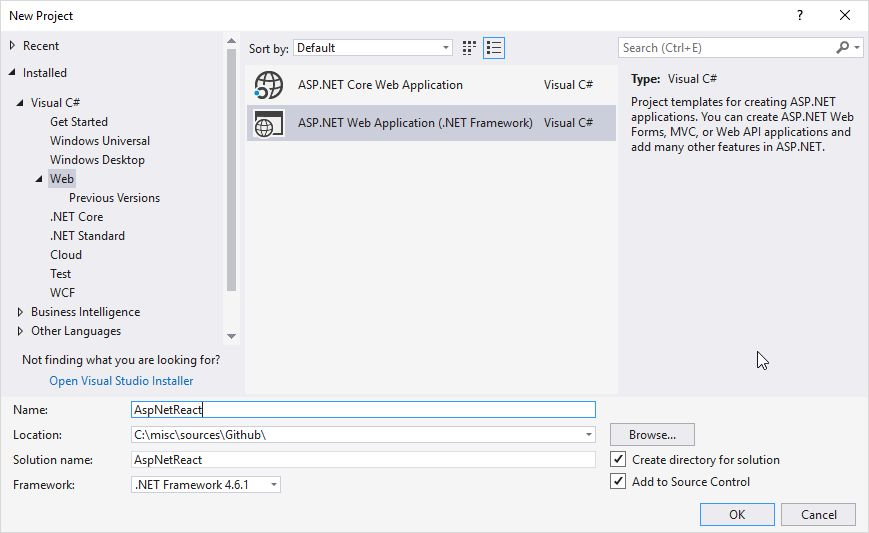
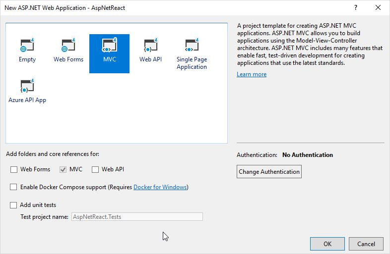
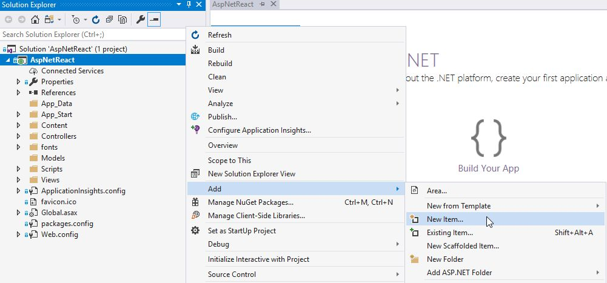
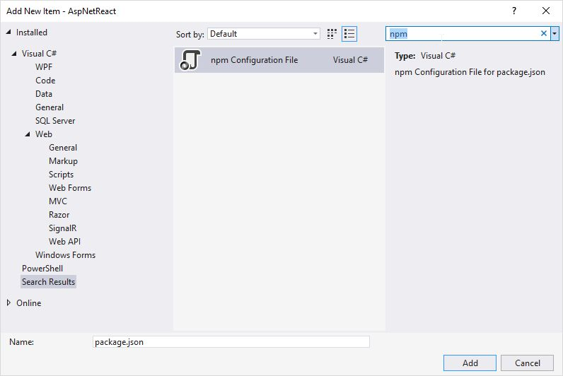
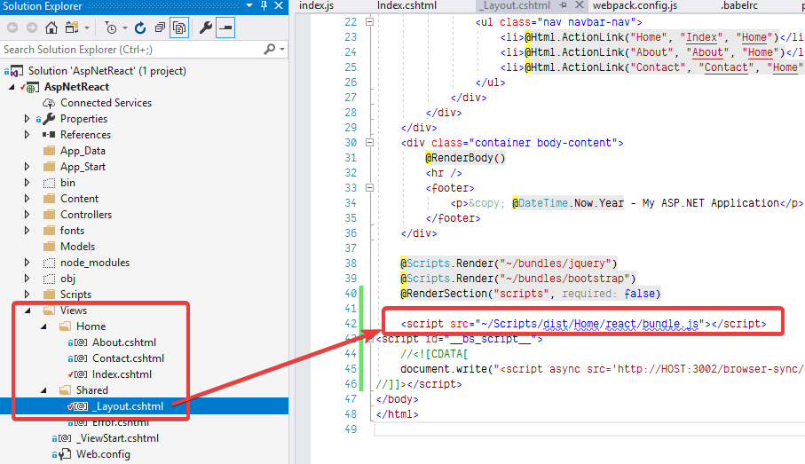
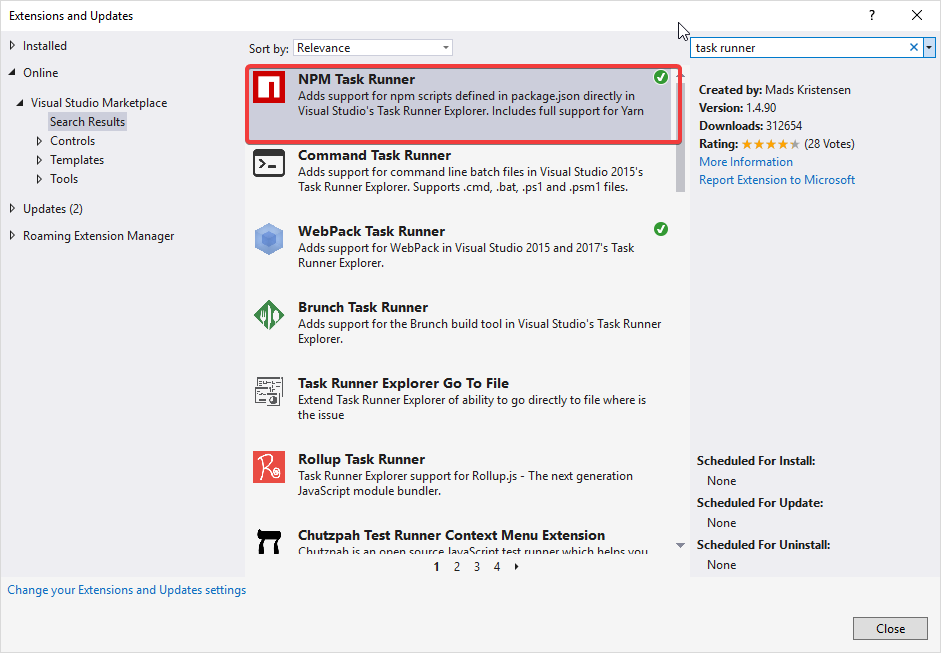
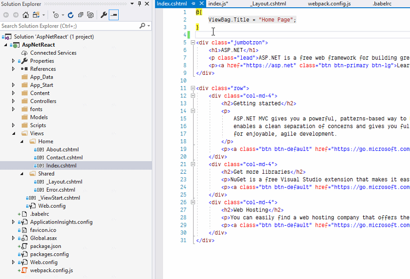
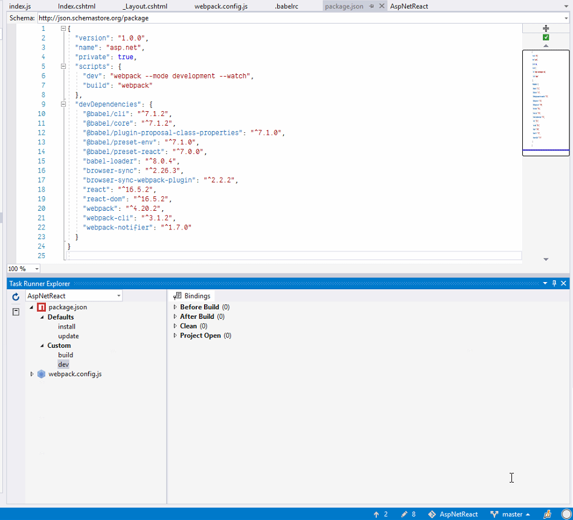
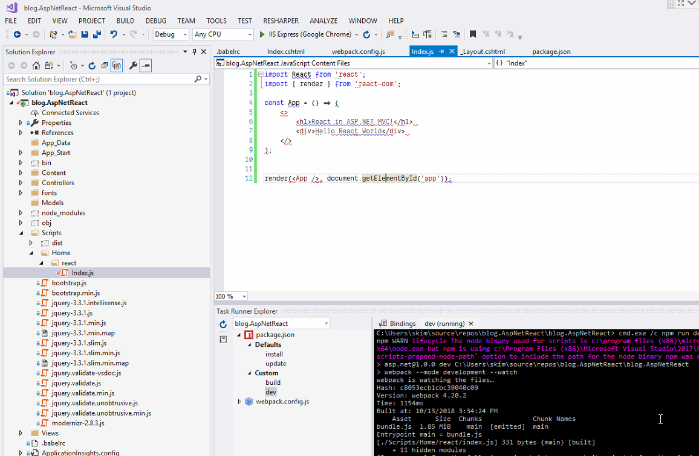
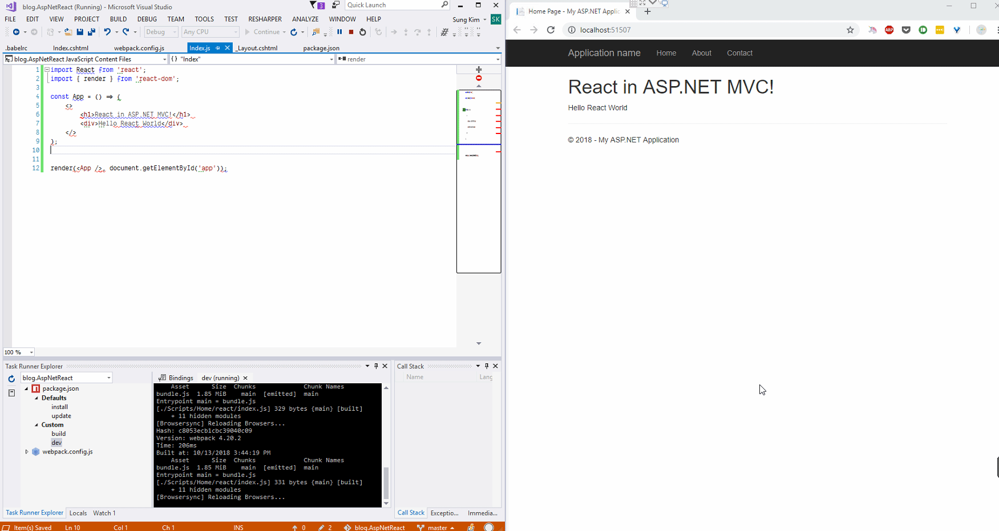

_Photo by [Zoltan Tasi](https://unsplash.com/photos/6vEqcR8Icbs?utm_source=unsplash&utm_medium=referral&utm_content=creditCopyText) on [Unsplash](https://unsplash.com/search/photos/atom?utm_source=unsplash&utm_medium=referral&utm_content=creditCopyText)_

I had a chance to update a legacy ASP.NET MVC website using AngularJS (yes, the first version) to use Webpack & Babel 7 (which used to import AngularJS files using script tags).

Previous post [Setting up an ES6 Environment for ASP.NET MVC 5](https://www.slightedgecoder.com/2017/05/22/setting-es6-environment-asp-net-mvc-5/) was a bit outdated as it was using older version of babel and webpack, so I decided write more concise post to get started with the newest libraries.

As I have moved onto React, I will show you how to set up React environment for ASP.NET MVC 5.

## 🧐 Prerequisite

I will assume that you are familiar with NPM & Webpack,   
so I won't go into too much details on what each option in NPM & Webpack.

## 👣 Setup Steps

1. Create an ASP.NET MVC web site
2. Create & configure NPM configuration file (package.json)
3. Create & configure Babel configuration file (.babelrc)
4. Create & configure Webpack configuration file (webpack.config.js)
5. Install NPM packages
6. Install Visual Studio Extensions (NPM Task Runner)

#### 1\. Create an ASP.NET MVC web site

Create a new ASP.NET MVC project (choose a choice of your .NET framework).

Create a new ASP.NET MVC Project

And select a template.

MVC Template

#### 2\. Create & configure NPM configuration file (package.json)

Add a new item in the project root.

Add New Item...

Create NPM configuration file, `package.json`.

npm Configuration File

And add a script section. And `package.json` would initially look like the following.

``gist:dance2die/b41670c22bef4553e197e3efcb43c664``

<a href="https://gist.github.com/dance2die/b41670c22bef4553e197e3efcb43c664">View this gist on GitHub</a>

#### 3\. Create & configure Babel configuration file (.babelrc)

Add a new file named `.babelrc` in the same directory as `package.json` file created in the previous step.

And add following babel options.

``gist:dance2die/a33a0590d930276754ca9b814707fba7``

<a href="https://gist.github.com/dance2die/a33a0590d930276754ca9b814707fba7">View this gist on GitHub</a>

- [@babel/preset-env](https://babeljs.io/docs/en/babel-preset-env) - enables latest JavaScript syntax
- [@babel/preset-react](https://babeljs.io/docs/en/next/babel-preset-react) -  adds support for React syntax
- [@babel/plugin-proposal-class-properties](https://babeljs.io/docs/en/next/babel-plugin-proposal-class-properties.html) -  adds support for an instance and/or static member declarations in JavaScript classes.

#### 4\. Create & configure Webpack configuration file (webpack.config.js)

Create a file named `webpack.config.js` in the project root (same location as `package.json` & `.babelrc`) & configure it as shown below.

``gist:dance2die/ce43a01f962ef07c7ad89a19d92428e5``

<a href="https://gist.github.com/dance2die/ce43a01f962ef07c7ad89a19d92428e5">View this gist on GitHub</a>

Webpack outputs a bundle as `./Scripts/dist/Home/react/bundle.js` so let's add the script in `View\Home\Index.cshtml` razor file.

``gist:dance2die/ef395768773057d1c45d6fe54a51f344``

<a href="https://gist.github.com/dance2die/ef395768773057d1c45d6fe54a51f344">View this gist on GitHub</a>

Bundle Script Tag

#### 5\. Install NPM packages

Now let's install NPM packages to enable latest JavaScript and React syntax.

``gist:dance2die/502546db05519ce16c768da263c90bfd``

<a href="https://gist.github.com/dance2die/502546db05519ce16c768da263c90bfd">View this gist on GitHub</a>

- [babel-loader](https://www.npmjs.com/package/babel-loader) - Webpack loader for babel
- [browser-sync](https://browsersync.io/) & [browser-sync-webpack-plugin](https://www.npmjs.com/package/browser-sync-webpack-plugin) - sync'ing browser upon code change
- [webpack](https://www.npmjs.com/package/webpack) & [webpack-cli](https://www.npmjs.com/package/webpack-cli) - for running Webpack
- [webpack-notifier](https://www.npmjs.com/package/webpack-notifier) - Shows pretty webpack notification
- [react](https://www.npmjs.com/package/react) & [react-dom](https://www.npmjs.com/package/react-dom) - React library

#### 6\. Install Visual Studio Extensions (NPM Task Runner)

This is an optional step but to make our lives easier, let's install a Visual Studio extension, [NPM Task Runner](https://marketplace.visualstudio.com/items?itemName=MadsKristensen.NPMTaskRunner) for running NPM scripts from Visual Studio.

NPM Task Runner Extension

## ⚛ Let's write some React code

Now we are ready to write a React script using the latest JavaScript syntax (ES6+).

Let's add an entry point for React in `Views\Home\Index.cshtml` file by  deleting everything except `ViewBag.Title` section and add `

`.

Now we have an entry point, let's write a simple React file `index.js` under `Scripts\Home\react` directory.

``gist:dance2die/f368f1116bbc34886334d3294817cb7c``

<a href="https://gist.github.com/dance2die/f368f1116bbc34886334d3294817cb7c">View this gist on GitHub</a>

index.js

## 🏃‍♀️Transpiling and Running

You could run the `dev` script within `package.json` file but let's use the NPM task runner to make the life easier.

Open the "Task Runner Explorer" by right clicking on `package.json` file in the project root.

Open Task Runner Explorer

Start `dev` script (double click), which monitors the changes in `index.js`.

Start "dev" script by double clicking on it

To enable browser-sync, you need copy a script generated by browser-sync message in `_Layout.cshtml` under `Shared` folder near end of `</body>` tag.

Copy Browser-sync Script

And lastly, let's run ASP.NET from Visual Studio to see the result.

Start ASP.NET MVC

## ♻ Reloading Browser Automatically

You've installed `browser-sync*` packages so as you change your code, the browser will reload automatically upon saving.

browser-sync at work

## 👋 Parting Words

In this post I've assumed that you know the basics of NPM & Webpack so skipped much of details so that you can easily get up and running.

Please refer to documentations linked in-line in the post if you want to understand how each step works and to troubleshoot should you run into an issue.

Source code is available on [GitHub](https://github.com/dance2die/blog.AspNetReact).
