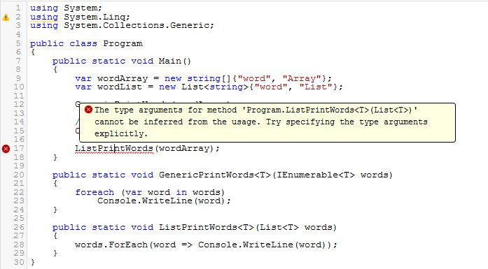

As I was chatting, someone from [Coding Blocks slack channel](https://www.codingblocks.net/slack/) (#javascript) has asked a question regarding a code snippet

`gist:dance2die/1c0f3799d371c2c4bdaf1603ed32f228`

His question was "Kinda lost in the `[].filter.call` , etc part."

I will show you a C# code snippet to explain "why" someone used [call](https://developer.mozilla.org/en-US/docs/Web/JavaScript/Reference/Global_Objects/Function/call) instead of directly calling [filter](https://developer.mozilla.org/en-US/docs/Web/JavaScript/Reference/Global_Objects/Array/filter).

## 🔨 Code Breakdown - uniqueInOrder

`uniqueInOrder` returns a distinct list of array for an order array with duplicate values.

Given an array `[1, 1, 2, 2, 2, 3, 3, 3, 3],` uniqueInOrder returns `[1, 2, 3]`.

<iframe style="width: 100%; height: 500px; border: 0; border-radius: 4px; overflow: hidden;" src="https://codesandbox.io/embed/w0mp565v75?autoresize=1&amp;codemirror=1&amp;expanddevtools=1&amp;hidenavigation=1&amp;moduleview=1&amp;view=split" sandbox="allow-modals allow-forms allow-popups allow-scripts allow-same-origin"></iframe>

But couldn't you have just used [Array#filter](https://developer.mozilla.org/en-US/docs/Web/JavaScript/Reference/Global_Objects/Array/filter)?

<iframe style="width: 100%; height: 500px; border: 0; border-radius: 4px; overflow: hidden;" src="https://codesandbox.io/embed/moowx3ynqx?autoresize=1&amp;codemirror=1&amp;expanddevtools=1&amp;hidenavigation=1&amp;module=%2Fsrc%2Findex.js&amp;moduleview=1&amp;view=split" sandbox="allow-modals allow-forms allow-popups allow-scripts allow-same-origin"></iframe>

Yes it works but `[].filter.call` can handle objects not derived from [Array](https://developer.mozilla.org/en-US/docs/Web/JavaScript/Reference/Global_Objects/Array).

## 🧐 What do you mean?

Some objects are iterable and not derived from Array. _Refer to this, [How I learned to Stop Looping and Love the Iterator](https://dev.to/kepta/how-i-learned-to-stop-looping-and-love-the-iterator-463j) post by [Kushan](https://dev.to/kepta) for details._

The (notoriously) notable one is [NodeList](https://developer.mozilla.org/en-US/docs/Web/API/NodeList), which is returned by [document.querySelectorAll](https://developer.mozilla.org/en-US/docs/Web/API/Document/querySelectorAll).

## 🤷 So What?

[filter](https://developer.mozilla.org/en-US/docs/Web/JavaScript/Reference/Global_Objects/Array/filter) is defined by Array prototype thus an object calling "filter" should implement an Array prototype. But NodeList doesn't implement Array prototype, so you can't call filter on it even though it's iterable.

`[].filter.call` lets you **use** the filter method without having to convert non-Array sequences into an array. _Therefore making "uniqueInOrder" method more generic._

Here is an example.

- `document.querySelectorAll('a')` returns an object of type NodeList.

- When you try to call filter directly, it fails.
- You can get around it by using a spread syntax.
- And [].filter.call works as well.

[document queryselctorall example](./images/document-queryselctorall.jpg) document queryselctorall example

## 🐳 C# Analogy

If you use C#, you might have run into [`IEnumerable<T>`](<https://msdn.microsoft.com/en-us/library/9eekhta0(v=vs.110).aspx>). It's an interface, which enables implementing class to be iterable.

Let's see two methods that accepts an iterable object of type string and prints each element.

<iframe width="100%" height="650" src="https://dotnetfiddle.net/Widget?Languages=CSharp&amp;CSharp_FiddleId=CBCHVu" frameborder="0"></iframe>

If you were to pass `wordArray` to `ListPrintWords`, it will fail to compile while `GenericPrintWords` is happy to work with it.

[caption id="attachment_1076" align="aligncenter" width="697"] Argument Error[/caption]

## 😀 What did we learn?

So `[].filter.call` can be used to deal with any iterable objects that do not inherit Array prototypes.

And it's roughly equivalent to dealing with objects implementing [`IEnumerable<T>`](<https://msdn.microsoft.com/en-us/library/9eekhta0(v=vs.110).aspx>) interface in .NET, thus enabling methods accept any kind of generic iterable sequences.

## 👋 Parting Words

I've had hard time understanding the WHY of such a method initially. I am able to see more when I make analogies to languages I am used to (C#).

Functional Programming (FP) in JavaScript is being adopted nowadays ([Redux](https://redux.js.org/), [Functional Light JS](https://github.com/getify/Functional-Light-JS) by Kyle Simpson), thus started learning [Elixir](https://elixir-lang.org/) to see WHY JavaScript community is raving about FP.

I'd love your feedback/errata. So leave a comment below or send me a [twit](https://twitter.com/slightedgecoder) :)
