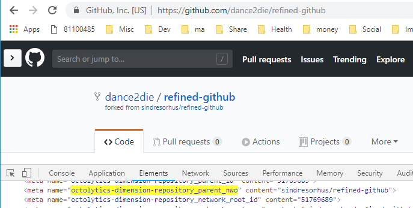
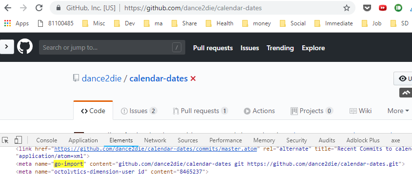

_Photo by _[_Sai Kiran Anagani_](https://unsplash.com/photos/5Ntkpxqt54Y?utm_source=unsplash&utm_medium=referral&utm_content=creditCopyText)_ on _[_Unsplash_](https://unsplash.com/search/photos/execute-code?utm_source=unsplash&utm_medium=referral&utm_content=creditCopyText)

_Note to self on how to get DOM content from Chrome Extension_

As I was building a Chrome Extension, [Easy GitHub](https://github.com/dance2die/easy-github) to generate I had to get DOM content on a GitHub page to see if it's a forked page or not.

Easy GitHub is to display initially a way to sync forked repository with the master repository.

Reference [Paul Seal](https://twitter.com/CodeSharePaul)'s blog - [How to keep your fork up to date with the master repository in GitHub](https://codeshare.co.uk/blog/how-to-keep-your-fork-up-to-date-with-the-master-repository-in-github/)

For forked GitHub page, GitHub page contains a meta tag named `octolytics-dimension-repository_parent_nwo` , which contains the parent repository the current repository is forked from.

But if the current page is not a fork repo page, then it doesn't have `octolytics-dimension-repository_parent_nwo` but have to use `go-import` meta value.

As a last resort, I needed to use `window.location.href`(or show a message that it's not a repo page in Chrome Extension popup).

When using `document.getElementBy*` or `document.querySelector*` within Chrome Extension, it fetches DOM for the extension HTML files, not from the tab content.

So to retrieve DOM content, one need to [execute](https://developer.chrome.com/extensions/tabs#method-executeScript) a script within a tab by sending a query (`document.querySelector*` or `document.getElement*`) like following.

``gist:dance2die/7c79a1e09b334da6d723bd07e2bb7682``

<a href="https://gist.github.com/dance2die/7c79a1e09b334da6d723bd07e2bb7682">View this gist on GitHub</a>

Execute Script within a Tab to extract DOM content

[_Source code_](https://github.com/dance2die/easy-github/blob/master/src/page_action/popup.js#L50) _on GitHub._

You can see above that, you pass a `code` to query DOM elements and extract URLs, which you can use to create a git command script.

You can add a [tabs permission](https://developer.chrome.com/extensions/tabs) to `execute` the script but it can be too detrimental thus you can simply add URLs to allow script executions.

``gist:dance2die/ff058d7fbc01103b1c3e8df4caae74dc``

<a href="https://gist.github.com/dance2die/ff058d7fbc01103b1c3e8df4caae74dc">View this gist on GitHub</a>

"permissions" section in Chrome Extension manifest.json

_Reference - Stack Overflow -_ [_chrome.tabs.executeScript not working?_](https://stackoverflow.com/a/45601794/4035)
