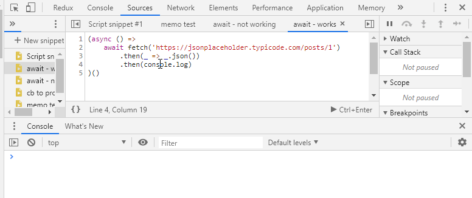
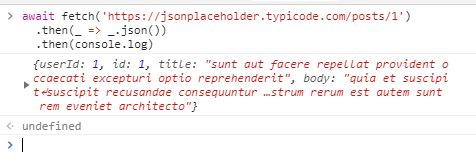
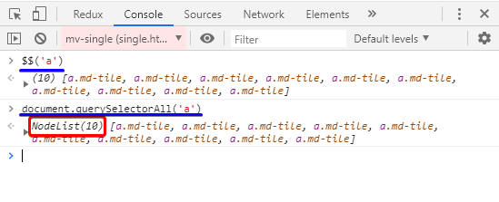
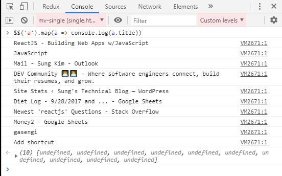
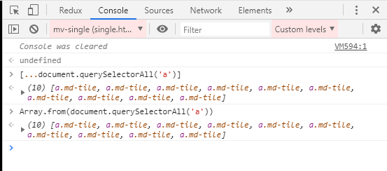

_Photo by_ [_Jason Leung_](https://unsplash.com/photos/ZV7lnfyQLmA?utm_source=unsplash&utm_medium=referral&utm_content=creditCopyText)_ on _[_Unsplash_](https://unsplash.com/search/photos/console?utm_source=unsplash&utm_medium=referral&utm_content=creditCopyText)

There are two surprising behaviors on Chrome Developer Tool Console ("console" hereafter).

First one was pointed out by my friend [Nicolas Marcora](https://twitter.com/nicolasmarcora) that you can await an async method, and second one being [$$](https://developers.google.com/web/tools/chrome-devtools/console/utilities#queryselectorall) (a short-cut for [document.querySelectorAll](https://developer.mozilla.org/en-US/docs/Web/API/Document/querySelectorAll)) returning an array, not a [NodeList](https://developer.mozilla.org/en-US/docs/Web/API/NodeList) object.

Let's go over how they are different.

## 1️⃣ Await in console

Within an editor (I am using a [Snippets](https://developers.google.com/web/tools/chrome-devtools/javascript/snippets) feature, which is like a scratchpad but works like an editor. You can try it in your favorite editor like, VS Code, Atom, or VIM), `await` does not work as it needs to be called within an async method.

To get around the issue, you can wrap it in an async method (an async [IIFE](https://developer.mozilla.org/en-US/docs/Glossary/IIFE) in this case).

This would be the normal behavior you are expecting but...  
You can await in the console without wrapping the statement in an async method~

It's Magic~~~

It's a behavior [added to Chrome Devtools since Chrome 62](https://developers.google.com/web/updates/2017/08/devtools-release-notes#await), released on year 2017.

So this is a nice feature but you have to watch out as you can't simply paste your code in your editor.  
It needs to be wrapped inside an async method.

## 2️⃣ $$ vs document.querySelectorAll

[$$](https://developers.google.com/web/tools/chrome-devtools/console/utilities#queryselectorall) is a part of Console Utilities API, which is available only within the console and not part of either JavaScript or [DOM](https://developer.mozilla.org/en-US/docs/Web/API/Document_Object_Model/Introduction).

[Google document](https://developers.google.com/web/tools/chrome-devtools/console/utilities#queryselectorall) describes `$$` as

> _$$(selector) returns an array of elements that match the given CSS selector. This command is equivalent to calling document.querySelectorAll()._
> 
> https://developers.google.com/web/tools/chrome-devtools/console/utilities#queryselectorall

The documentation says it's equivalent to calling [document.querySelectorAll()](https://developer.mozilla.org/en-US/docs/Web/API/Document/querySelectorAll) but `$$` is differs  
where `document.querySelectorAll()` returns a [NodeList](https://developer.mozilla.org/en-US/docs/Web/API/NodeList) object while `$$` returns an array.

`NodeList` is an [array-like object](http://speakingjs.com/es5/ch18.html#_pitfall_array_like_objects), whose prototype doesn't inherit from [Array.prototype](https://developer.mozilla.org/en-US/docs/Web/JavaScript/Reference/Global_Objects/Array/prototype). That means, a `NodeList` object instance doesn't have access to methods such as [Array#map](https://developer.mozilla.org/en-US/docs/Web/JavaScript/Reference/Global_Objects/Array/map) or [Array#reduce](https://developer.mozilla.org/en-US/docs/Web/JavaScript/Reference/Global_Objects/Array/Reduce).

Can't map over NodeList object

While you can map over $$

This can cause a problem when you copy & paste code using `$$` selector and simply convert it to using `document.querySelectorAll()` and try to call `Array.prototype`

_You can easily convert a NodeList object to an array using a_ [_spread syntax_](https://developer.mozilla.org/en-US/docs/Web/JavaScript/Reference/Operators/Spread_syntax) _or_ [_Array.from_](https://developer.mozilla.org/en-US/docs/Web/JavaScript/Reference/Global_Objects/Array/from) _by the way._

## 👋 Parting Words

The console can save you a lot of keystrokes but you might want to double check before copying & pasting the code from console to the editor.

If you have more gotchas please let me know 🙂

